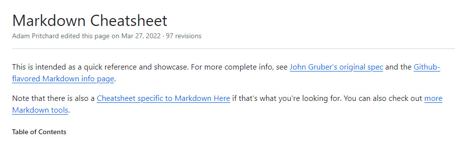

# Project Title

## Project Summary

Describe the purpose of your project - I would probably keep this brief and not get into very technical details here. This is mainly an overview of what the project is.

### Markdown Details

Markdown is used to format your README files and there are a number of things you can do

* Add bulleted lists
* With multiple Items

1. Add numbered lists
2. With multiple Item

#### Add Tables

|id|first|last|
|--|-----|----|
|1|John|Williams|

#### Add Images



#### Insert Code snippets

You can add code inline with a backtick `Book book = new Book();`.

Or you can add full code blocks

```java
public class Book
{

}
```
